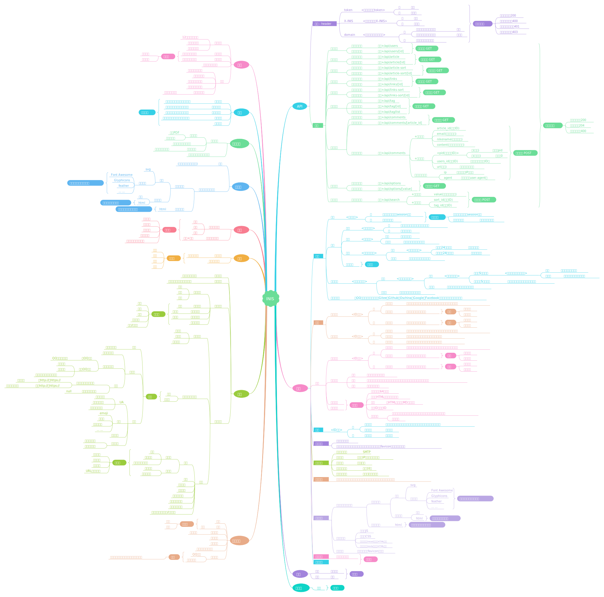

<!-- 

 -->

# INIS API

> 如少年般，迎风而立

[在线预览 Preview](http://inis.cn) | [使用文档](api/article)

#### 1、INIS是什么？

!> 目前INIS的定义是一个功能丰富的博客系统，但后期不只是博客系统

#### 2、INIS API的作用是什么？

!> INIS采用的是前后端的设计，INIS API是INIS的一个分支，INIS API提供API接口，将数据给前端，就类似于一个CMS管理系统

!> 并且INIS API开放了接口文档，可以供不懂后端的开发者快速部署并开发一个前端，后面还会有更多的接口会被设计和开放出来，目前INIS还处于逐步完善的阶段

INIS设计图 - Ver-1.0

	

作者：<a href="https://racns.com">兔子</a>
