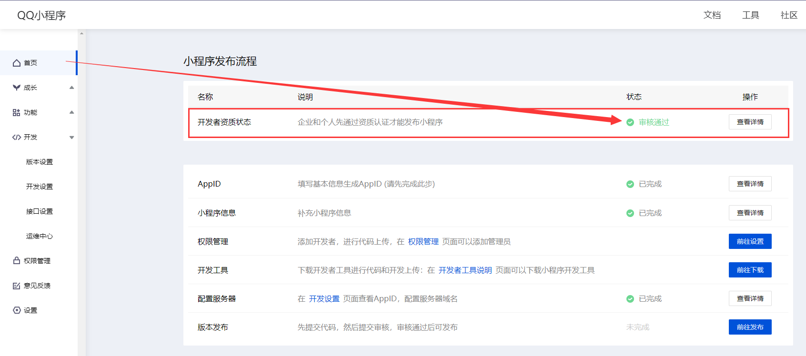
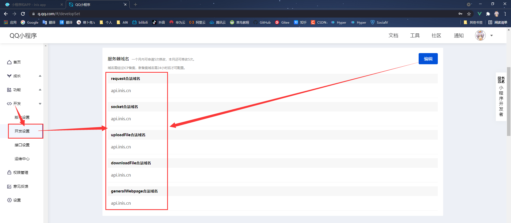
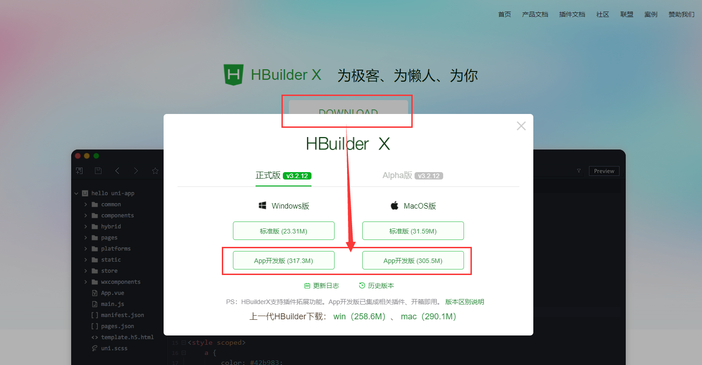
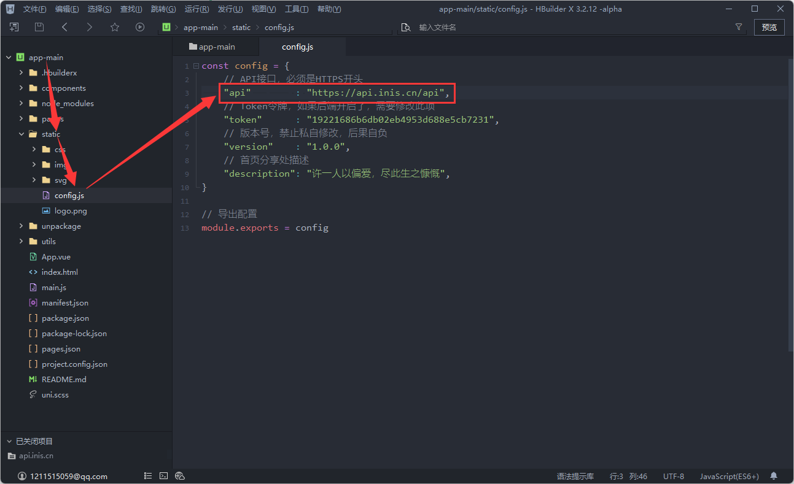

## 简介

!> `inis app`使用`uni-app`开发，遵循`uni-app`规范，`inis app`兼容了`QQ和微信平台小程序`，可以打包发布到`QQ和微信小程序平台`，也可以打包为`Android`和`IOS`的APP

> 这里以`inis app`打包并发布到`QQ小程序`举例，以及如何打包为`Android`的APP

## 1、注册QQ小程序平台帐号

!> 首先我们需要前往 [QQ小程序](https://q.qq.com/) (网址：https://q.qq.com) 注册一个帐号   

!> 接着在 [QQ小程序](https://q.qq.com/) 登录，并进行`开发者资质认证`   

!> 最后在左边菜单栏中找到，开发->开发设置 中，`记录AppID`（一会要用到）并配置`服务器域名`   

> 服务器域名是你的inis后端域名（注意：小程序的发布，后端必须配置了SSL，也就是必须是https）

## 2、下载inis app源码和工具

!> 工具需要用到 `uni-app` 官方提供的 `HBuilderX` IDE编辑器（用于打包代码） 和 `QQ小程序开发者工具`（用于上传代码）

> `inis app源码` 下载地址：   
> GitHub：https://github.com/inis-cloud/app   
> Gitee：https://gitee.com/inis-cloud/app （推荐）

> `HBuilderX` 下载地址：https://www.dcloud.io/hbuilderx.html   
> 根据自己的情况选择 `Windows` 或 `MacOS` 版本即可

> `开发者工具` 下载地址：（根据自己的情况下载QQ或微信的开发者工具）   
> `QQ小程序开发者工具`：https://q.qq.com/wiki/tools/devtool/   
> `微信开发者工具`：https://developers.weixin.qq.com/miniprogram/dev/devtools/download.html

!> 将 `HBuilderX` 和 `QQ小程序开发者工具` 或 `微信开发者工具` 进行安装

## 3、打包源码为QQ小程序并发布

!> 打开 `HBuilderX` 并导入 `inis app` 源码

<video src="../assets/img/start/20211102_160215.mp4" controls>Not Support</video>

!> 修改配置文件，将api修改为自己的`inis api`，inis api = http(s)://域名/api

!> 顶部菜单栏->发行->小程序-QQ

> QQ小程序名称自己定义，QQ小程序AppId是先前在QQ小程序平台让记录的AppId

<video src="../assets/img/start/20211102_161247.mp4" controls>Not Support</video>

> 如果发生了类似视频中这种编译失败：（预编译器错误：代码使用了scss/sass语言，但未安装相应的编译器插件）   
> 这种是因为依赖的插件缺失导致的，可以按照视频中的方法进行下载插件，其他类似情况同理   

<video src="../assets/img/start/20211102_164134.mp4" controls>Not Support</video>

!> 使用 `QQ小程序开发者工具` 导入打包好的源码包，并上传   

> 最后前往 [QQ小程序](https://q.qq.com/) 开发->版本设置->开发版本 中选为体验版或提交审核，审核通过方可发布为正式的线上版本

<video src="../assets/img/start/20211102_161849.mp4" controls>Not Support</video>

## 总结

!> 因为发布到微信小程序的教程网上随处可见，因此这里以少见的QQ小程序发布举例，其实不管是QQ还是微信小程序的发布，或是别的平台小程序发布，方法大同小异，这一套源码不仅支持`QQ和微信小程序`，其他小程序理论上也可以打包，具体有待各位去验证

## 打包为Android或IOS的APP

!> 接下来我们讲讲怎么使用这套源码打包为`Android`和`IOS`的APP

<video src="../assets/img/start/20211102_163221.mp4" controls>Not Support</video>

> 打包完成会在控制台处提示打包好的安装包路径，这里以 `Android` 的安装包举例，只需要将打包完成的apk安装包在安卓手机安装即可正常使用

