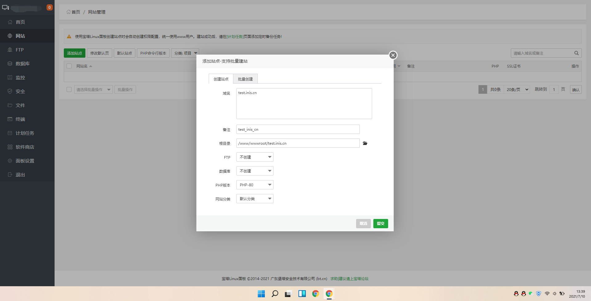

> 这里我们以`宝塔面板举例`，其他小伙伴可以根据部署的思路在其他环境部署`inis system`

## 1、创建网站

!> 后端使用的是`ThinkPHP 6`框架，`PHP >= 7.4`（支持并推荐使用`PHP 8`），`MySQL >= 5.5`

## 2、上传后端代码

!> 将后端源代码文件 `inis system` 上传到 `后端域名` 文件目录下

## 3、设置运行目录

!> 将`public`设置为运行目录

## 4、配置伪静态

## 5、创建数据库

## 6、添加授权域名

!> 在 [官网](//inis.cc) [域名授权](//inis.cc/admin/comm/login.html) 中添加`后端域名`

[域名授权演示](../assets/img/start/20210710_141214.mp4 ':include')

> `域名注册信息`：请上传域名证书或者能证明域名属于自己的信息   
> PS：请勿上传表情包或其他信息，否则审核不通过（域名授权通过后，方可正常安装）

## 7、开始引导安装

!> 在浏览器中打开你的后端域名`开始安装引导`，比如：http://test.inis.cn   

<video src="../assets/img/start/20210710_145335.mp4" controls="">Not Support</video>

## 8、完成

!> 至此，inis system安装完成！   
默认账号：admin   
默认密码：123456