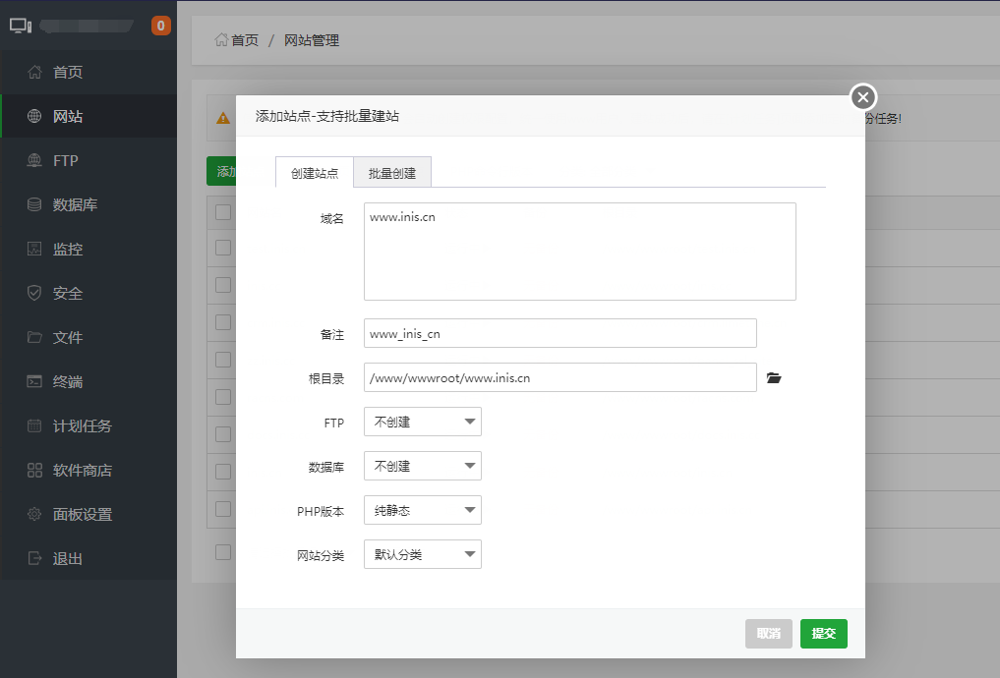
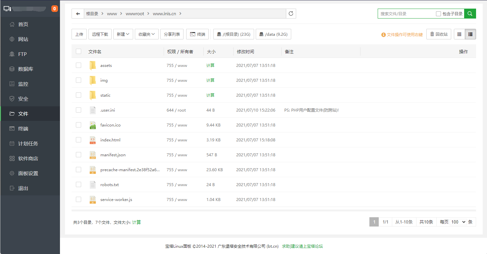
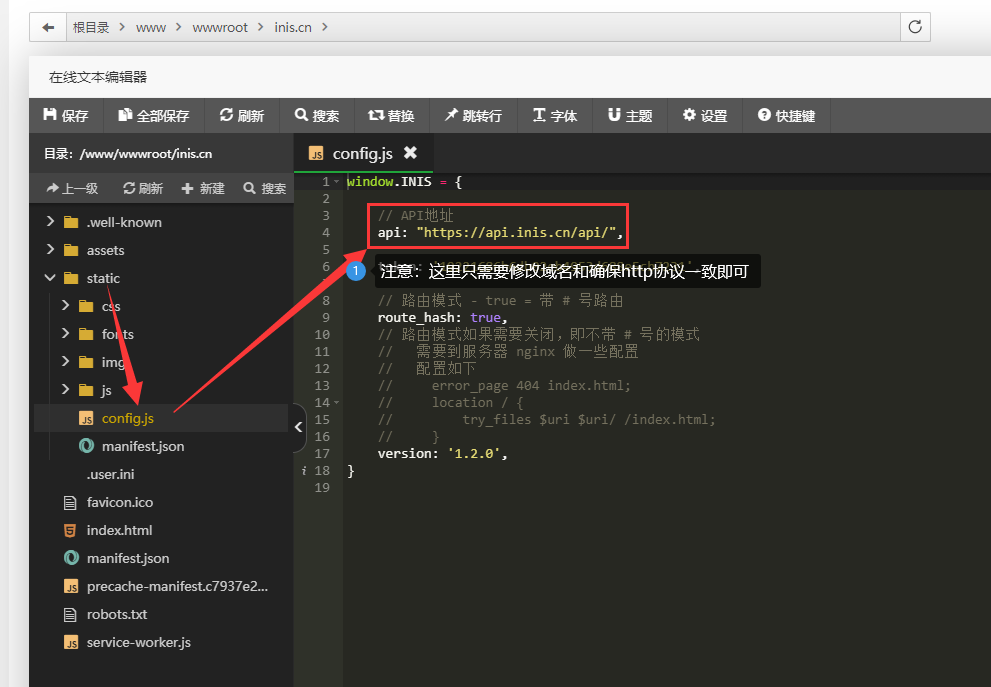
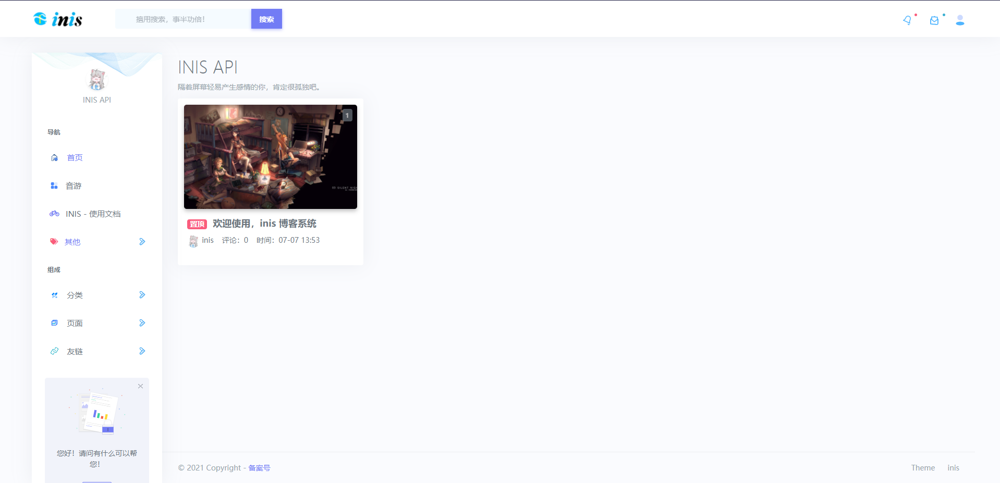
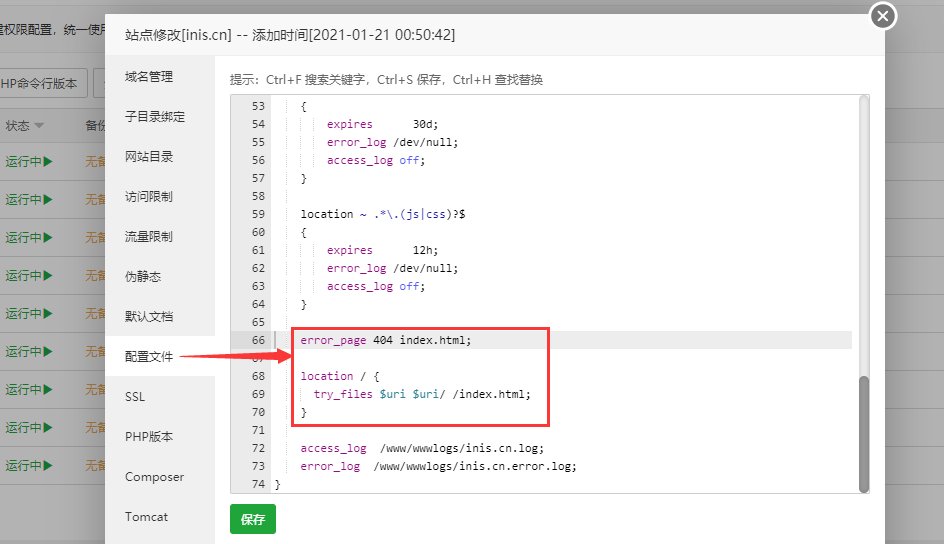
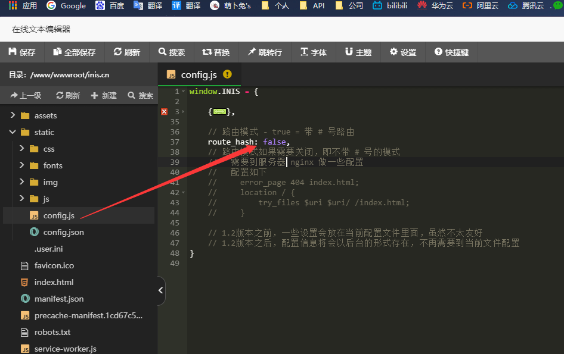

> 这里我们以`宝塔面板举例`，其他小伙伴可以根据部署的思路在其他环境部署`inis theme`

### 1、创建网站

!> 前端的`默认主题`使用的是vue3开发的，可以发布为`纯静态`



### 2、下载inis主题

!> `inis theme` 在 [官网](//inis.cc) [主题](//inis.cc/index/theme) 处下载

<video src="../assets/img/start/20210710_152935.mp4" controls="">Not Support</video>

### 3、上传前端代码

!> 将`前端主题源代码`上传到`前端域名`文件目录下



### 4、修改配置文件

!> 修改config.js配置文件，路径：`/www/wwwroot/域名/static/config.js`



### 5、验证部署结果

!> 在浏览器中打开你的前端域名，比如：http://www.inis.cn



> 如果你能正常打开这个页面，并且有文章数据，则表示前端成功部署   
> 如果非首次打开这个页面，记得 `ctrl f5` 刷新缓存

### 6、其他配置

!> 默认主题的默认路由模式是带 # 号的，如果需要去掉 # 号，则需要到 Nginx 做些许配置   
配置如下图所示

##### 一、第一步（配置环境）

<!-- tabs:start -->

#### ** Nginx **



```Nginx
server
{
    error_page 404 index.html;
    location / {
        try_files $uri $uri/ /index.html;
    }
}
```

#### ** Apache **

> 这个人很懒，什么都没写！

#### ** IIS **

> 这个人很懒，什么都没写！

<!-- tabs:end -->

##### 二、第二步（修改主题路由模式）



##### 三、第三步（刷新浏览器缓存）

> 打开你的主题网址，ctrl f5强制刷新浏览器缓存，即可看到效果
