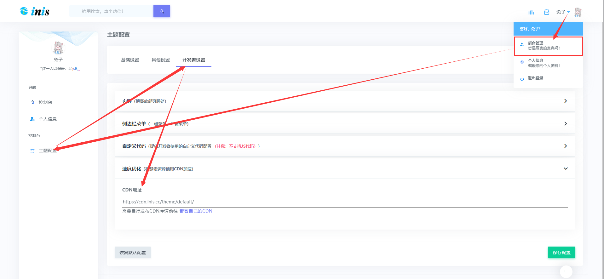
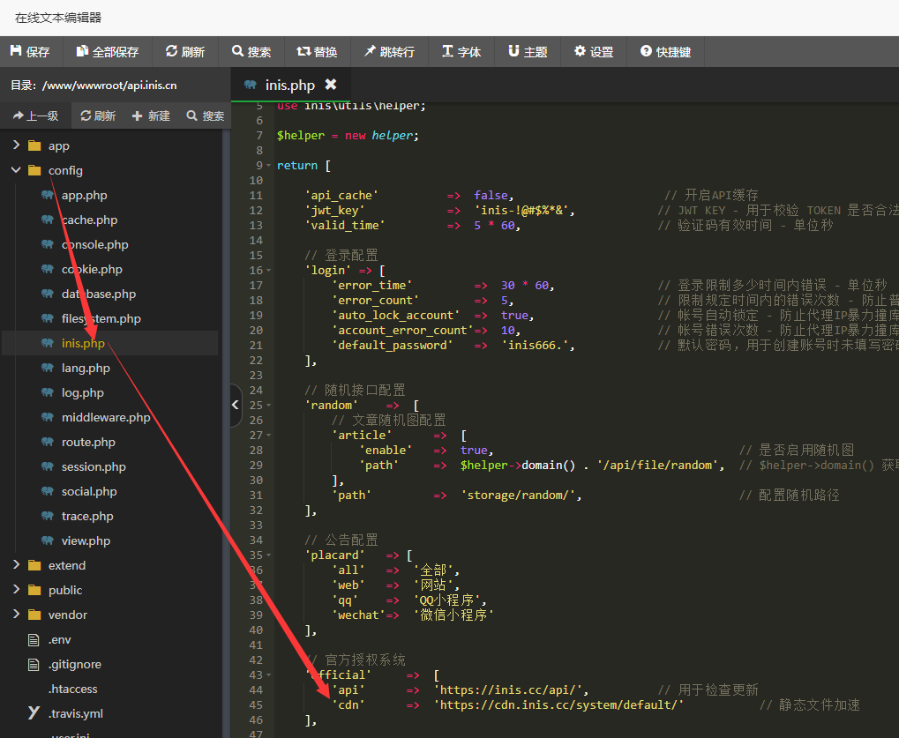

## 简介

!> CDN可以达到加速静态资源的效果，目前inis系统和默认主题都增加了提交CDN加速地址的入口

> 以下为CDN地址

| 名称 | inis系统CDN地址 | 默认主题CDN地址 | 备注 |
| :---- | :---- | :---- | :---- |
| 官方一 | `https://cdn.inis.cc/system/default/` | `https://cdn.inis.cc/theme/default/` | 稳定，速度还行 |
| 官方二 | `https://cdn.inis.cn/system/default/` | `https://cdn.inis.cn/theme/default/` | 速度不行，反向加速 |

> 第三方大佬提供的CDN地址   

| 名称 | inis系统CDN地址 | 默认主题CDN地址 | 大佬昵称 | 大佬友链 | 备注 |
| :---- | :---- | :---- | :---- | :---- | :---- |

!> 感谢以上大佬提供的CDN，虽然目前还没有

## 使用说明

<!-- tabs:start -->

#### ** 默认主题 **

#### ** inis系统 **

<!-- tabs:end -->

## 资源提交 

!> `主题开发者`可以联系 [兔子 QQ：97783391](//sighttp.qq.com/authd?IDKEY=88b4f3cf4135ec404e52910040df6a4d540c8af4f6d84957) ，将您的资源上传到CDN中，为您开发的inis主题达到加速的效果

## 部署CDN

!> 如果你是`大佬`，想为inis`贡献`您的`CDN`，为广大inis用户加速静态资源，请往下看

> 首先您需要到 [GitHub](https://github.com/inis-cloud/cdn ':target=_blank') 或 [Gitee](https://gitee.com/inis-cloud/cdn ':target=_blank') 将CDN库下载并部署到您的服务器即可   
> GitHub：[https://github.com/inis-cloud/cdn](https://github.com/inis-cloud/cdn ':target=_blank')   
> Gitee：[https://gitee.com/inis-cloud/cdn](https://gitee.com/inis-cloud/cdn ':target=_blank')